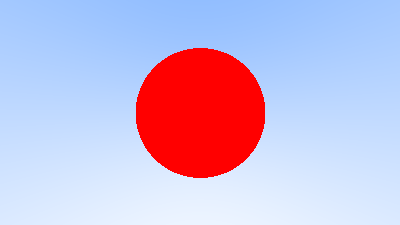
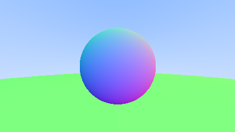

# Raytracing Weekend
A basic path tracer based on the [Ray Tracing in One Weekend](https://raytracing.github.io/) book.


## About

Compared to the guide, I made some modifications to accommodate personal goals as described below:

- While the authors opted for a C-style approach in their coding, I adopted the [Google C++ Style Guide](https://google.github.io/styleguide/cppguide.html) to help fully embrace the language and its modern usage.


## Getting Started

#### Requirements

- clang (tested with 18.1.8)

#### Execution

```bash
make && make run > hello.ppm
```

The [PPM](https://en.wikipedia.org/wiki/Netpbm) (portable pixmap format) file can be opened in common image viewers.

## Imagery

Here are some of the images produced while developing this path tracer.


|  |  |
|--|--|
 | 
 | 
 |
